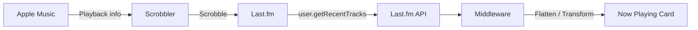

[Apple Music](https://music.apple.com/) 确实[提供官方的 API](https://developer.apple.com/documentation/applemusicapi)，不过这需要加入 Apple Developer Program，意味着每年需要交 99 USD 的费用。对于一些简单的需求，例如获取正在播放状态、最近播放列表而言是不划算的。

因此，可以尝试另辟蹊径。利用 Scrobble [^ **Scrobbling** is the process of recording what a user listens to and sending that listening data to Last.fm. source: https://en.wikipedia.org/wiki/Last.fm]（中文这里可以理解为“收听记录同步”或“收听记录上报”） 可以将 Apple Music 的音乐播放信息 Scrobble 到 Last.fm 的数据库，进而通过 Last.fm 的 API 使用。

利用 Last.fm 的 API，简单概括为以下几步：
1. 前往 last.fm 注册一个账号
2. 注册并验证账户后，前往 https://www.last.fm/api/account/create 创建一个新的 API account，其中 `name` `description` `callbackURL` 按需随意填写即可。完成后保存生成的 api key。
3. 完整的信息示例如下：
```plaintext
API account created
Here are the details of your new API account.

Application name	lastplayed
API key	xxxxxx   <- Will be used later
Shared secret	yyyyyy
Registered to	gengyue
```

Last.fm 的 API `baseUrl` 是 https://ws.audioscrobbler.com/2.0/ ，一个最简单的请求类似：`GET https://ws.audioscrobbler.com/2.0/?method=user.getrecenttracks&user=gengyue&api_key=xxxxxx&limit=1&format=json`[^ 替换这里 params 的 `user` `api_key` 为自己的，可调整 `page` `limit` 参数。最高支持 200 项。] 

这个接口会返回一个 JSON，`Interface` 类似：

```typescript
interface LastFmTrack {
  artist: { "#text": string };
  image: Array<{ size: string; "#text": string }>;
  album: { "#text": string };
  name: string;
  url: string;
  "@attr"?: { nowplaying?: string };
  date?: { uts: string; "#text": string };
}
```

为了简化，推荐自行搭建一个 middleware [^ 任何流行的后端框架都可以，例如我使用 [Hono](https://hono.dev/)]来获取并处理数据，将原来膨大的数组扁平化，可以做到返回结构类似：

```json
[
  {
    "artist": "Andrew Lloyd Webber & \"Cats\" 1981 Original London Cast",
    "image": "https://lastfm-img.freetls.fastly.net/i/u/300x300/2a96cbd8b46e442fc41c2b86b821562f.png",
    "album": "Highlights from Cats (Original London Cast Recording)",
    "name": "Prologue: Jellicle Songs For Jellicle Cats",
    "url": "https://www.last.fm/music/Andrew+Lloyd+Webber+&+%22Cats%22+1981+Original+London+Cast/_/Prologue:+Jellicle+Songs+For+Jellicle+Cats",
    "nowplaying": true,
    "playedAt": null
  },
  {
    "artist": "Andrew Lioyd Webber & Carrie Hope Fletcher",
    "image": "https://lastfm-img.freetls.fastly.net/i/u/300x300/2a96cbd8b46e442fc41c2b86b821562f.png",
    "album": "Highlights From Andrew Lloyd Webber’s “Cinderella”",
    "name": "I Know I Have A Heart (From Andrew Lloyd Webber’s “Cinderella”)",
    "url": "https://www.last.fm/music/Andrew+Lioyd+Webber+&+Carrie+Hope+Fletcher/_/I+Know+I+Have+A+Heart+(From+Andrew+Lloyd+Webber%E2%80%99s+%E2%80%9CCinderella%E2%80%9D)",
    "nowplaying": false,
    "playedAt": 1789829662
  }
]
```

**至此，数据处理有了！那么，数据从哪里来呢？**

:::fullwidth



:::

我们之前提到，本质上 Last.fm 作为收听记录数据库，自然需要我们从本地 "Scrobble" 即上报收听记录到 Last.fm [^ 详见上方的 Mermaid 流程图]，这个过程中就需要一些 Scrobbler 软件辅助。我在这里使用的是 [Pano Scrobbler](https://github.com/kawaiiDango/pano-scrobbler)，多端支持，支持同步到多个 Scrobbling 服务。当然，也可以随便选择合适的 Scrobbler，基本流程如下：
1. 下载并在 Scrobbler 上认证 Last.fm 
2. 打开 Apple Music 并播放音乐，在 Scrobbler 中选择来源 AM
3. 请求 Last.fm API，看看是否工作正常。

All done，It works!

**局限与不足**本质上这是一种权宜之计，由于 Last.fm 的 API 并不支持 WebSocket，因此只能牺牲一部分实时性（例如使用简单轮询代替长连接）。Scrobbler 的不稳定行为和神秘 Bug 也是另一方面，由于某些行为，`Now Playing` 的状态更新并不及时，不过对于大多数场景，想必已经足够。同时，这个过程中依赖本地 Scrobbler 可能会白白增加无用的功耗，这也是一个可能需要权衡的问题。

我根据上述思路制作了[首页的 Now Playing 卡片](/)，至少它工作了。我自认为这个很酷，如果您也感兴趣的话，或许可以试试看。下面是一个 demo：

<now-playing-card></now-playing-card>