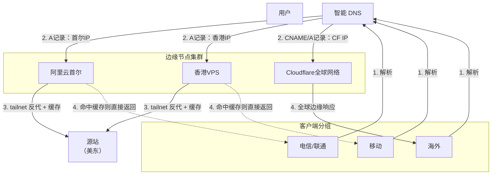

博客的源站位于美东，虽说使用 Cloudflare 的全球网络从中国大陆访问不是什么问题，但是速度实在太慢[note: 毕竟 Cloudflare 素有 “CF 减速器” 之美称]，手中还有两台吃灰的垃圾线路小鸡，想想毕竟是亚太地区的，拿来手搓一个边缘节点反代一下美东源站应该不错。

本次用到的垃圾机机：
- 阿里云首尔轻量 BGP，2c[note: 实际上是 1c/2t] 0.5g 20gb ssd，使用学生 300 券开了一年
- 某不知名杂牌 Oneman 家人商家香港国际线路，1c 0.5g 10gb

因为两台机器配置实在不高，因此操作系统选择了极致轻量的 [Alpine Linux](https://www.alpinelinux.org/)，毕竟跑个 Nginx 还是没有什么问题的。推荐开启 TCP 调优和 BBR。

阿里云首尔轻量因为是 BGP 线路，虽然说对中国大陆没有什么优化，但三网延迟相对均衡，电信和联通（尤其联通）延迟比较好看，移动则会飙升到 90 - 120ms，相对而言就不是那么好看了，因此选用了家人云的香港国际线路移动 CMI 直连的优势来优化移动的网络。 

我的计划是，用 ap.cdnno.de 作为亚太流量的统一入口，让需要优化的路由 CNAME 接入。因为需要配置的路由也不多，因此就在主力机上处理证书和 nginx 配置，边缘的两台机器通过 `crontab` 定时拉取主机上的 nginx 配置和证书。边缘 nginx 处理请求通过 tailnet 反代源站的同时，顺便在边缘节点上缓存[note: 对于不同的静态资源类型，推荐设置不同的 TTL。例如：图片/CSS/字体此类不太容易改变的资源设置较长的 TTL，HTML 等变动较大的资源设置较小的 TTL]，这样进一步减轻了源站的压力，同时亦加速了中国大陆的访问。[note: 因为请求可以直接在边缘节点上响应，而不用经历反代源站的过程。 同时推荐在边缘节点开启 Brotli/Gzip 压缩，进一步减小响应大小。]

对于中国大陆外的海外流量，由于 Cloudflare 全球节点还是很强大，因此应该让它们解析到 Anycast/Cloudflare，这就需要用到智能 DNS 解析。看了一下国内支持智能 DNS 解析的服务提供商，发现**华为云**这项服务是免费的，自然选择华为云处理 DNS 解析。虽说域名托管在 Cloudflare，但是仍然可以通过 NS 记录接入华为云，只需要根据页面提示将需要加速的子域名的 NS 记录改成华为云的权威 NameServer 即可。

> 这里推荐使用 [Cloudflare for SaaS](https://developers.cloudflare.com/cloudflare-for-platforms/cloudflare-for-saas/)，可以利用自定义主机名让域名在不托管到 Cloudflare 的情况下受益于 Cloudflare 的全球网络，十分适合配合智能 DNS 实现海内外分流。

最终的智能 DNS 解析方案：

- 中国电信/中国联通：阿里云首尔
- 中国移动：家人云香港
- 中国大陆外地域：Cloudflare 边缘节点

最终的网络路由：

:::fullwidth

:::
最终效果：

- 全国的 Ping 延迟：

- 全国的网页测速：

此方案的优点是国内访问速度可以大大提升，但是**绝对不能保证 SLA**，对于个人服务，此方案尚可以接受；对于生产环境，其实不推荐使用此类方案。一个更好的替代方案是亚太的 CDN，例如 EdgeOne，但是没备案的域名腾讯提供的 EdgeOne 节点均绕新加坡或美国。此时，这个方案也许并非毫无价值，或许可以说是垃圾佬对垃圾的充分开发了。