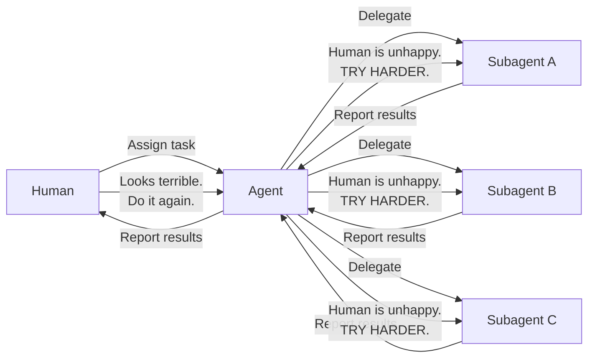

哈喽，我目前就读于 [华中科技大学](https://hust.edu.cn) [计算机科学与技术专业](https://cs.hust.edu.cn/)，是**大二**的小东西。[冰岩作坊](https://www.bingyan.net/) 前端组成员。

摆，比较摆 [^ 摆烂]

有一个~~很大~~的 tailnet [^ 这是一种 SDN 组网技术，基于 Wireguard 和 UDP 穿透。在特定 NAT 类型或有 IPv6 的场景下，组网效果还算不错，但是可能会被封 UDP 或 UDP QoS]内网，有很多奇怪的小鸡，感兴趣可以看一下[探针](https://v-ps.net)

~~可能~~在鞭策 Agent 工作，例如：

如果您想看一些其它的东西，可参阅：

- 我的 [Blog](/blog) [^ 博客，由 <svg width="19.1" height="18" viewBox="0 0 35 33" fill="none" xmlns="http://www.w3.org/2000/svg" class="w-4 h-4"><path d="M13.2371 21.0407L24.3186 12.8506C24.8619 12.4491 25.6384 12.6057 25.8973 13.2294C27.2597 16.5185 26.651 20.4712 23.9403 23.1851C21.2297 25.8989 17.4581 26.4941 14.0108 25.1386L10.2449 26.8843C15.6463 30.5806 22.2053 29.6665 26.304 25.5601C29.5551 22.3051 30.562 17.8683 29.6205 13.8673L29.629 13.8758C28.2637 7.99809 29.9647 5.64871 33.449 0.844576C33.5314 0.730667 33.6139 0.616757 33.6964 0.5L29.1113 5.09055V5.07631L13.2343 21.0436" fill="currentColor" id="mark"></path><path d="M10.9503 23.0313C7.07343 19.3235 7.74185 13.5853 11.0498 10.2763C13.4959 7.82722 17.5036 6.82767 21.0021 8.2971L24.7595 6.55998C24.0826 6.07017 23.215 5.54334 22.2195 5.17313C17.7198 3.31926 12.3326 4.24192 8.67479 7.90126C5.15635 11.4239 4.0499 16.8403 5.94992 21.4622C7.36924 24.9165 5.04257 27.3598 2.69884 29.826C1.86829 30.7002 1.0349 31.5745 0.36364 32.5L10.9474 23.0341" fill="currentColor" id="mark"></path></svg> Grok 翻译自 English]
- 我的 [Logbook](/logbook) [^ 日志，由 <svg width="19.1" height="18" viewBox="0 0 35 33" fill="none" xmlns="http://www.w3.org/2000/svg" class="w-4 h-4"><path d="M13.2371 21.0407L24.3186 12.8506C24.8619 12.4491 25.6384 12.6057 25.8973 13.2294C27.2597 16.5185 26.651 20.4712 23.9403 23.1851C21.2297 25.8989 17.4581 26.4941 14.0108 25.1386L10.2449 26.8843C15.6463 30.5806 22.2053 29.6665 26.304 25.5601C29.5551 22.3051 30.562 17.8683 29.6205 13.8673L29.629 13.8758C28.2637 7.99809 29.9647 5.64871 33.449 0.844576C33.5314 0.730667 33.6139 0.616757 33.6964 0.5L29.1113 5.09055V5.07631L13.2343 21.0436" fill="currentColor" id="mark"></path><path d="M10.9503 23.0313C7.07343 19.3235 7.74185 13.5853 11.0498 10.2763C13.4959 7.82722 17.5036 6.82767 21.0021 8.2971L24.7595 6.55998C24.0826 6.07017 23.215 5.54334 22.2195 5.17313C17.7198 3.31926 12.3326 4.24192 8.67479 7.90126C5.15635 11.4239 4.0499 16.8403 5.94992 21.4622C7.36924 24.9165 5.04257 27.3598 2.69884 29.826C1.86829 30.7002 1.0349 31.5745 0.36364 32.5L10.9474 23.0341" fill="currentColor" id="mark"></path></svg> Grok 翻译自 English]
-  我的 [GitHub](https://github.com/gengyue2468)  [^ 吉特哈布，由 <svg width="19.1" height="18" viewBox="0 0 35 33" fill="none" xmlns="http://www.w3.org/2000/svg" class="w-4 h-4"><path d="M13.2371 21.0407L24.3186 12.8506C24.8619 12.4491 25.6384 12.6057 25.8973 13.2294C27.2597 16.5185 26.651 20.4712 23.9403 23.1851C21.2297 25.8989 17.4581 26.4941 14.0108 25.1386L10.2449 26.8843C15.6463 30.5806 22.2053 29.6665 26.304 25.5601C29.5551 22.3051 30.562 17.8683 29.6205 13.8673L29.629 13.8758C28.2637 7.99809 29.9647 5.64871 33.449 0.844576C33.5314 0.730667 33.6139 0.616757 33.6964 0.5L29.1113 5.09055V5.07631L13.2343 21.0436" fill="currentColor" id="mark"></path><path d="M10.9503 23.0313C7.07343 19.3235 7.74185 13.5853 11.0498 10.2763C13.4959 7.82722 17.5036 6.82767 21.0021 8.2971L24.7595 6.55998C24.0826 6.07017 23.215 5.54334 22.2195 5.17313C17.7198 3.31926 12.3326 4.24192 8.67479 7.90126C5.15635 11.4239 4.0499 16.8403 5.94992 21.4622C7.36924 24.9165 5.04257 27.3598 2.69884 29.826C1.86829 30.7002 1.0349 31.5745 0.36364 32.5L10.9474 23.0341" fill="currentColor" id="mark"></path></svg> Gork 翻译自 English]
-  我的 [碎碎念](https://memos.gy.run) [^ Powered by Memos]

更多的页面可以从网页顶部的 More 下拉菜单中找到

欢迎找我聊天，我的 Email 是 [hi [at] gengyue.dev](mailto:hi@gengyue.dev)

最后感谢您花时间阅读这个页面，尽管我不知道您是怎么找到这个网页的
