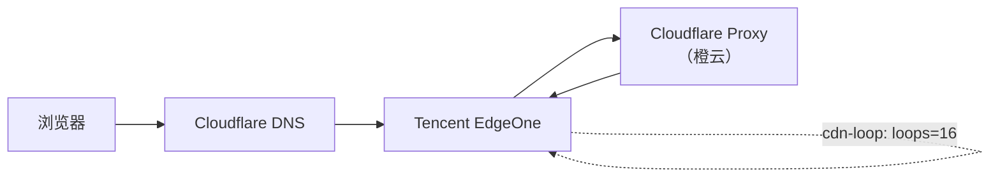
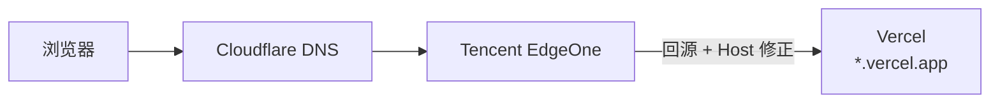

哎，前段时间在看 GitHub 上网站部署记录的时候猛然发现 [Cloudflare Pages](https://pages.cloudflare.com) 上的服务已经爆爆了 100+ 次部署了[note:竟然还有 bug 删除不了超过 100 次的部署，很神奇]，因为我先后从 [Next.js](https://nextjs.org) 迁移到 [React Router](https://reactrouter.com) 再到现在的 Plain HTML 写作，我一次都没有改过 framework type 和输出目录[note:这之间似乎还有 Pages Router 到 App Router 的迁移]，哎，爆爆就爆爆了。不过，这倒提醒我了，我之前似乎在腾讯云 [EdgeOne](https://edgeone.ai/) 上美美白嫖的 CDN 套餐还没用 😋，这不得试吃一下 🤤。

打开腾讯云官网，然后“使用 Google 登录”，然后“快速登录”，哎，这就成了。然后再控制台面板上找到添加站点，用 CNAME 解析一下。不过要注意，这里还是要把整个站放到腾讯云 EdgeOne 里头，即使我们只需要用到几个子域名就 OK。我用 [Cloudflare](https://cloudflare.com) 的 DNS 解析，只需要添加一条 TXT 记录就行了，相当 smooth![note:这一步验证 DNS 还是很有必要的，利好后面的 SSL 证书申请]

然后美美挑选了一个漂亮的子域名，添加到 EdgeOne 规则里头[note:注意用 Cloudflare 的话 CNAME 记录要仅代理]，然后随便选一个预设 template 就 OK，回源填自己的网站主域名，all done！然后美美申请免费 SSL 证书，稍等片刻，访问，我靠，怎么 324 错误了！于是立刻`curl -I`一下，看看怎么回事：

```
$ curl -I https://cdn.gengyue.site/
HTTP/1.1 423 Locked
cdn-loop: TencentEdgeOne; loops=16
Server: cloudflare
nel: {"success_fraction":0.1,"report_to":"eo-nel","max_age":604800}
report-to: {
  "endpoints":[{"url":"https://nel.teo-rum.com/eo-cgi/nel"}],
  "group":"eo-nel",
  "max_age":604800
}
cf-cache-status: DYNAMIC
speculation-rules: "/cdn-cgi/speculation"
alt-svc: h3=":443"; ma=86400
CF-RAY: 9bd1933598a30e68-AMS
Content-Length: 0
Connection: keep-alive
Date: Tue, 13 Jan 2026 02:48:30 GMT
EO-LOG-UUID: 13426361529703584917
EO-Cache-Status: MISS
```

哎，看来 SSL 配置没生效？先等等看。

等了差不多 30 分钟？再试试看：

```
$ curl -I https://cdn.gengyue.site/
HTTP/1.1 423 Locked
cdn-loop: TencentEdgeOne; loops=16
Server: cloudflare
nel: {"success_fraction":0.1,"report_to":"eo-nel","max_age":604800}
report-to: {
  "endpoints":[{"url":"https://nel.teo-rum.com/eo-cgi/nel"}],
  "group":"eo-nel",
  "max_age":604800
}
cf-cache-status: DYNAMIC
speculation-rules: "/cdn-cgi/speculation"
alt-svc: h3=":443"; ma=86400
CF-RAY: 9bd1933598a30e68-AMS
Content-Length: 0
Connection: keep-alive
Date: Tue, 13 Jan 2026 02:48:30 GMT
EO-LOG-UUID: 13426361529703584917
EO-Cache-Status: MISSxxxxxxxxxx $ curl -I https://cdn.gengyue.site/HTTP/1.1 423 Lockedcdn-loop: TencentEdgeOne; loops=16Server: cloudflarenel: {"success_fraction":0.1,"report_to":"eo-nel","max_age":604800}report-to: {  "endpoints":[{"url":"https://nel.teo-rum.com/eo-cgi/nel"}],  "group":"eo-nel",  "max_age":604800}cf-cache-status: DYNAMICspeculation-rules: "/cdn-cgi/speculation"alt-svc: h3=":443"; ma=86400CF-RAY: 9bd1933598a30e68-AMSContent-Length: 0Connection: keep-aliveDate: Tue, 13 Jan 2026 02:48:30 GMTEO-LOG-UUID: 13426361529703584917EO-Cache-Status: MISS$ curl -I https://cdn.gengyue.site/HTTP/1.1 423 Locked cdn-loop: TencentEdgeOne; loops=16 Server: cloudflare nel: {"success_fraction":0.1,"report_to":"eo-nel","max_age":604800} report-to: {"endpoints":[{"url":"https://nel.teo-rum.com/eo-cgi/nel"}],"group":"eo-nel","max_age":604800} cf-cache-status: DYNAMIC speculation-rules: "/cdn-cgi/speculation" alt-svc: h3=":443"; ma=86400 CF-RAY: 9bd1933598a30e68-AMS Content-Length: 0 Connection: keep-alive Date: Tue, 13 Jan 2026 02:48:30 GMT EO-LOG-UUID: 13426361529703584917 EO-Cache-Status: MISS
```

哎，怎么还是这样。看来不是 SSL 的问题了。仔细一想，似乎是 Cloudflare CDN 代理主站的原因了，看来还是得删除掉 Cloudflare Proxy！于是换成仅代理。

哎，怎么还是不行，`curl`一下看看，发现`Server`竟然还是`Cloudflare`，哎，问了 ChatGPT 它告诉我 EdgeOne 的加速服务用的是 Cloudflare 的部分节点？？晕，一看就不靠谱。看来是搞出 CDN Loop 了，害，蒜鸟。

用 ChatGPT 画了个图，大概就是下面这样：
:::fullwidth

:::


等下，我们为啥要直接回源源站呢？[Vercel](https://vercel.com)似乎提供了一个免费的`*.vercel.app`域名，我们直接回源这个不就行了。反正我们的 EdgeOne 也是在非中国大陆地区运行的，这似乎很适合。[note:vercel.app 在中国大陆的可用性为 0]

于是妙妙将源站回源地址改成 `*.vercel.app` 然后等等部署再`curl`测试一番，欸，怎么还是不行，后来改了一下回源 hosts，神奇的好了。[note:欸，那之前的配置估计也是回源 hosts 不匹配被 EdgeOne 当成 Loop 了...，那么...懒，不改了]现在：

```
$ curl -I https://cdn.gengyue.site/static/hust/hust.webp
HTTP/1.1 200 OK
Access-Control-Allow-Origin: *
Age: 0
Content-Disposition: inline; filename="hust.webp"
Content-Type: image/webp
Etag: "9b9b5c738a665ef2ce85ecba3a5f77e0"
Server: Vercel
Strict-Transport-Security: max-age=63072000; includeSubDomains; preload
X-Vercel-Cache: HIT
X-Vercel-Id: fra1::nhl99-1768314272898-dfc7de69cffb
Last-Modified: Tue, 13 Jan 2026 14:24:33 GMT
Content-Length: 137622
Accept-Ranges: bytes
Connection: keep-alive
Date: Tue, 13 Jan 2026 14:24:32 GMT
EO-LOG-UUID: 12182038518495320345
EO-Cache-Status: MISS
Cache-Control: max-age=3600
NEL: {"success_fraction":0.1,"report_to":"eo-nel","max_age":604800}
Report-To: {"endpoints":[{"url":"https://nel.teo-rum.com/eo-cgi/nel"}],"group":"eo-nel","max_age":604800}
```

好耶！成功了。大概的工作原理见下图：
:::fullwidth

:::

剩下的工作就是在 EdgeOne 上配置一些服务逻辑啥的了，比如搞个非`/static/``/fonts`目录就直接`throw new error (403)`之类的东西，外加设置个缓存头之类的什么，总之，现在静态文件加载快多了，还不用浪费轻量云少得可怜的流量！美美的吃😋[note: TTL 缓存对于字体可以搞 365 天，图片之类的 30 天也行，反正不怎么更新...]