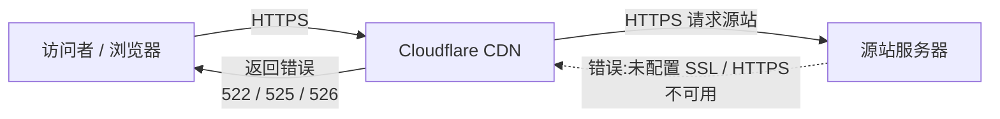
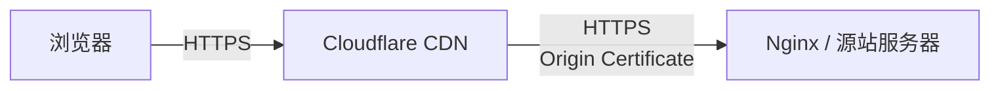

前段时间对域名在[腾讯云](https://cloud.tencent.com)上进行了一下 ICP 备案，大概过了半个月左~~右~~[note:哎腾讯云控制台你说大概 12 天还真就 12 天啊，在考思政之前收到了短信...]，然后就准备把博客从 [Vercel](https://vercel.com) 搞到闲置的轻量云服务器上，反正就是十几二十个 HTML 页面，放到服务器上 nginx 反代一配，占不了几个内存和带宽，国内速度还快不少，何乐而不为？[note:静态资源已经美美托管到[EdgeOne](https://edgeone.ai)上了😋，参见[这篇文章](/edgeone-test)]

于是就准备搞搞，打开 [Cloudflare 控制台](https://dash.cloudflare.com) 然后添加一条 `A` 记录指向`ip`地址，噫，这很好。然后打开www.gengyue.site一看，woc，怎么 522 了，原来是 CF 无法访问到源站导致的。

于是就想想，CF 怎么会访问不到源站的，哦，原来是这样，CF 的 Rules 配置默认是搞到“完全”，表明访问者和 CF, CF 和 源站之间都要采用 HTTPS 加密连接，而源站没有配置好 SSL，自然 CF 去连接是连不上的，大概流程如下：

:::fullwidth



:::

一个比较简单粗暴的解决方案是直接把 Rules 换成“灵活”，哎，这样就解决了。不过我们如果还是想让 CF 和源站之间加密连接呢，自然还是有办法的。一般来说可以考虑：

- 用 [Let's Encrypt]([Let's Encrypt](https://letsencrypt.org/zh-cn/)) 颁发的证书来签名，这样似乎还很不错，嘻嘻，不过我嫌麻烦。
- 用 Cloudflare 提供的十五年期限的、只有 CF 和源站服务器之间信任的边缘证书，这个问题似乎就迎刃而解了。

哎，直接去`SSL/TLS → Origin Server → Create Certificate`这个位置，搞到一个证书，为

+ gengyue.site
+ *.gengyue.site

申请 15 年的证书有效期就 OK 了，然后 CF 会给你一段 **Origin Certificate**和一段 **Private Key**。[note:像大多数的 key 一样，这个私钥只显示一次]

然后登录服务器，输入下面的命令配置`nginx`

```bash
cd /etc/nginx/ssl/
```

然后新建个文件夹用来存证书和私钥：

```bash
sudo mkdir -p /etc/nginx/ssl
sudo chmod 700 /etc/nginx/ssl
```

```bash
sudo nano /etc/nginx/ssl/cf_origin.crt
sudo nano /etc/nginx/ssl/cf_origin.key
```

把得到的东西复制进去就ok了，嘻嘻，还是相当容易的。然后顺便配置一下`nginx.conf`，就像这样：

```nginx
server {
    listen 443 ssl http2;
    server_name gengyue.site www.gengyue.site;

    ssl_certificate     /etc/nginx/ssl/cf_origin.crt;
    ssl_certificate_key /etc/nginx/ssl/cf_origin.key;

    ssl_protocols TLSv1.2 TLSv1.3;
    ssl_ciphers HIGH:!aNULL:!MD5;

    ......
}
```

似乎可以把 80 端口重定向到 HTTPS：

```nginx
server {
    listen 80;
    server_name gengyue.site www.gengyue.site;
    return 301 https://$host$request_uri;
}
```

然后重启 nginx：

```bash
sudo nginx -t
sudo systemctl reload nginx
```

好耶，看来是成功了，回到控制台，把 Rules 放心大胆地调成完全（严格），然后再访问www.gengyue.site，嗯？怎么还是报 522 错误，怎么 CF 还是连不上源站？怎么又白忙活了一大顿？？😭

等下，我们去看看防火墙规则，登录腾讯云控制台，看到 443 端口确实是对公网 Ipv4 地址开放的啊，怎么回事呢？啊哈？哦，说不定 CF 默认用 Ipv6 连，而我们的服务器没开放 Ipv6！让我们试试看！[note: Cloudflare 似乎确实是这样的...]

woc，怎么还是连不上，要爆炸了。等下`ufw status`下看看，woc，破案了！ ufw 阻止了 443 端口的流量，让我们赶紧开放 443 的 v4 和 v6 端口：

```bash
sudo ufw allow 443/tcp
sudo ufw reload
sudo ufw status
443/tcp ALLOW
```

测试一下，好耶：

```bash
curl -I https://www.gengyue.site
HTTP/2 200
server: cloudflare
```

现在的请求链路大概是这样的：

:::fullwidth



:::

哦吼吼，不过折腾一大顿之后发现自己似乎南辕北辙了，CF 的节点在美国，大陆请求到美国代理到美国的 Vercel 服务器和大陆请求到美国的 CF 节点再代理到大陆的轻量云服务器，还真说不准谁的速度块？😂[note:哎，哎，哎]

不过延迟也是从 400ms 降低到 100 ~ 200ms 了，哎，如果不是套一层 CF 何至于这么慢？不过为了安全着想嘛...[note:笑死，就你那破烂垃圾都没有人有攻击的欲望，笑死...(bushi]

