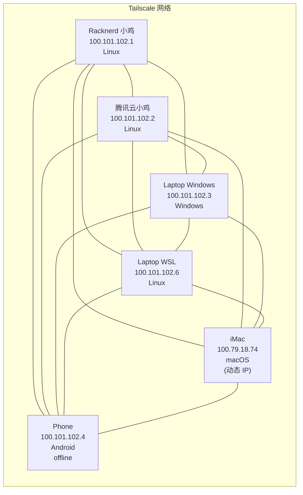

前天试着用 Wireguard 给手里的两台小鸡和 Laptop 组个大内网，一开始跑的还行，结果昨天晚上莫名奇妙地连不上了，一看 Last handshake 7 hours ago...就这么莫名奇妙地掉线了，哎，于是找了找别的，发现 [Tailscale](https://tailscale.com/) [note: WireGuard 是经典的轻量 VPN，需要手动配置 `Interface` 和 `Peer`，适合对网络控制要求高的场景。Tailscale 则是在 WireGuard 基础上做了零配置优化，多平台设备可以自动连起来，跨 NAT/防火墙也更稳，适合快速组个人或小型实验内网。] 似乎还行，而且不用像 Wireguard 那样手写 `[Interface]` 和 `[Peer]` ，试试看！

先给 Racknerd 的小鸡装：

```bash
curl -fsSL https://tailscale.com/install.sh | sh
sudo tailscale up
tailscale status
```

好耶，看到自己了，再把腾讯云的小鸡拉进去，重复上面的工作！

再把 Laptop 拉进去，哎，根据 Guideline，似乎用 *#Windows Powershell* 连不如 *#GUI* 稳定，于是下载 GUI App，启动，连上，完美！[note:手机也可以安装 Tailscale App，配置极其简单！]

然后在 iMac 上安装 Tailscale App，大失败，重启之后必定掉线！找了半天文档外加求助 LLM 都没整好，哎，macOS 怎么这么坏啊。

最后的结果：

```bash
gengyue@gengyue-laptop:~$ tailscale status
100.101.102.6  laptop-wsl            gengyue2468@  linux    -
100.79.18.74   gengyue-imac          gengyue2468@  macOS    -
100.101.102.3  laptop                gengyue2468@  windows  -
100.101.102.4  phone                 gengyue2468@  android  offline, last seen 4h ago
100.101.102.1  racknerd-seattle      gengyue2468@  linux    -
100.101.102.2  tencent-cloud-canton  gengyue2468@  linux    -
```

哎，可以看到 *#imac* 在这里是一个动态的 IPv4 地址，因为每次重启电脑都需要重新认证，哎，好烦。不过似乎也用不着这个机器，需要的时候再让老父亲打开认证一下吧......[note:macOS 的妙妙机制真的很~~迷人~~烦人...]

最终结果：

