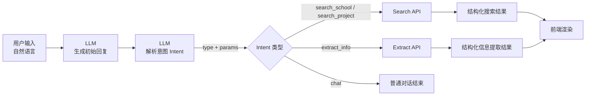

前段时间 jyi 写了一个留学申请的院校库后端 api，闲的没事想要试试 [PPIO](https://ppio.com) 爆的金币的 LLM 模型的 intent parsing 怎么样，毕竟之前自己也没试过，也是第一次玩玩这个玩意儿，试试看。

首先，~~作为懒惰的人类~~，我们要用 LLM 完成 LLM 应该做的事情，简单用 LLM 规划一下结构：

```
/api
- /intent
  - route.ts
- /chat
  - route.ts
```

> 其实要试验一下 intent parsing 只需要第一个`/intent` api 路由就足够了[note:因为我们本质上在找一种用户自然语言到 JSON schema 的映射关系，LLM 只是帮助我们处理这一层]，不过我更喜欢让 llm 输出一些废话😋

我们的思路是，llm 根据我们喂给它的 system prompt 中的 api route 文档，生成一个结构化的 JSON schema，然后前端通过某些神秘操作解析这个 JSON，根据 `type` 和相关的 `params` 请求对应的 API，拿到数据之后放在前端展示就 ok。

得益于 [Next.js](https://nextjs.org) 天然的 API Route 优势，我们可以轻松地创建这样一个 `/api/intent/route.ts` 文件：

```ts
import OpenAI from "openai";
import { NextResponse } from "next/server";

const openai = new OpenAI({
  baseURL: process.env.PPIO_BASE_URL,
  apiKey: process.env.PPIO_API_KEY,
});

export async function POST(req: Request) {
  try {
    const { query } = await req.json();

    const completion = await openai.chat.completions.create({
      model: "deepseek/deepseek-v3.2",
      stream: false,
      messages: [
        {
          role: "system",
          content: `你是一个智能 API 操作生成器。根据用户的自然语言输入，分析意图并生成对应的操作。

支持的操作类型：

1. search_school - 搜索学校
参数（均为可选）：
- region: 地区中文名称（如：中国香港、中国澳门、英国、美国）
- region_en: 地区英文名称
- school_name: 学校中文名称（模糊匹配）
- school_name_en: 学校英文名称（模糊匹配）
- min_rank: QS排名最小值（<=该值）
- max_rank: QS排名最大值（>=该值）
- sort_by: 排序字段（qs_rank_2025, qs_rank_2026, school_name, school_name_en）
- sort_order: 排序顺序（asc 或 desc）
- limit: 每页数量（默认20）
- offset: 偏移量（默认0）

2. search_project - 搜索项目
参数（均为可选）：
- region: 地区中文名称
- region_en: 地区英文名称
- school_name: 学校中文名称（模糊匹配）
- school_name_en: 学校英文名称（模糊匹配）
- major_category: 专业类别（如：计算机、电气电子、商科、体育）
- project_name: 项目中文名称（模糊匹配）
- major_en: 专业英文名称（模糊匹配）
- min_ielts: 雅思最小分数
- max_ielts: 雅思最大分数
- min_toefl: 托福最小分数
- max_toefl: 托福最大分数
- min_tuition: 学费最小值
- max_tuition: 学费最大值
- is_open: 是否开放申请（0或1）
- sort_by: 排序字段（project_name, major_en, tuition, ielts, toefl）
- sort_order: 排序顺序（asc 或 desc）
- limit: 每页数量（默认20）
- offset: 偏移量（默认0）

3. extract_info - 提取个人信息
当用户提供个人背景材料时使用（如：简历、成绩单、经历描述等）
参数：
- raw_material: 用户提供的原始材料文本

规则：
1. 判断用户意图是搜索学校、搜索项目还是提取信息
2. 搜索学校时type为"search_school"，搜索项目时type为"search_project"，提取信息时type为"extract_info"
3. 对于排名范围，如"QS前100"表示 min_rank=100
4. 默认 limit=20
5. 只生成有值的参数，不要生成空值

请直接返回 JSON 格式的结果，格式如下：
{
  "type": "search_school" 或 "search_project" 或 "extract_info",
  "params": {
    // 参数对象
  }
}

不要输出任何其他文字，只输出 JSON。`,
        },
        {
          role: "user",
          content: query,
        },
      ],
      response_format: { type: "json_object" },
    });

    const content = completion.choices[0].message.content;

    if (!content) {
      return NextResponse.json(
        { error: "No response from LLM" },
        { status: 500 },
      );
    }

    const result = JSON.parse(content);
    console.log("Intent API Result:", result);
    return NextResponse.json(result);
  } catch (error: unknown) {
    console.error("Intent API Error:", error);
    return NextResponse.json(
      { error: (error as Error).message || "Failed to process query" },
      { status: 500 },
    );
  }
}

```

ok，下面可以和 llm 进行一些亲密的对话了，比如：

```
用户输入：
“帮我找一下 QS 前 100 的英国计算机硕士项目”
```

我们预期 llm 回复这样的 JSON schema：[note:结构化的 JSON 在这里非常重要，llm 经常会不听话，比如生成\```这样的 markdown 语法]

```json
{
  "type": "search_project",
  "params": {
    "region": "英国",
    "major_category": "计算机",
    "min_rank": 100
  }
}
```

好耶，如果是这样，那很好了，我们可以轻松调用后面的 api 啦！我们像这样创建一个 hooks，比如叫`/hooks/use-chat.ts`：[note:省略大部分 UI/Loading 层的东西]

```ts
async function handleUserInput(query: string) {
  /* await fetch("/api/llm/chat", {
    method: "POST",
    body: JSON.stringify({ query }),
  }); */ // 可选：让 llm 先输出一段废话，让用户觉得 llm 确实在干活
   
  const intentResp = await axios.post("/api/llm/intent", { query });
  const { type, params } = intentResp.data;
    
  switch (type) {
    case "search_school":
    case "search_project": {
      const { data } = await axios.get("/api/search", {
        params: { type, ...params },
      });
      return { type: "search", data };
    }

    case "extract_info": {
      const { data } = await axios.post("/api/extract", {
        raw_material: params.raw_material ?? query,
      });
      return { type: "extract", data };
    }

    default:
      return null;
  }
}
```

其实现在看来逻辑链路很清楚了，大概就是这样：

:::fullwidth



:::

okk~ 看来实现的差不多了，不过有的时候 llm 还是会犯毛病啥的，乱编一些 `params` 或者即使参数好不容易搞对了，后端请求之后发现没有返回值？哎，这就看出来有个 `/api/chat` 路由和用户~~胡扯/唠嗑/氵时长~~的优势了...

哎，其实这么看llm当作搜索中间层还挺好的，这似乎是什么模糊搜索库都达不到的效果啊...[note:不过直接让 llm 胡搜/胡说八道可还是蒜鸟，幻觉可够严重的...]

