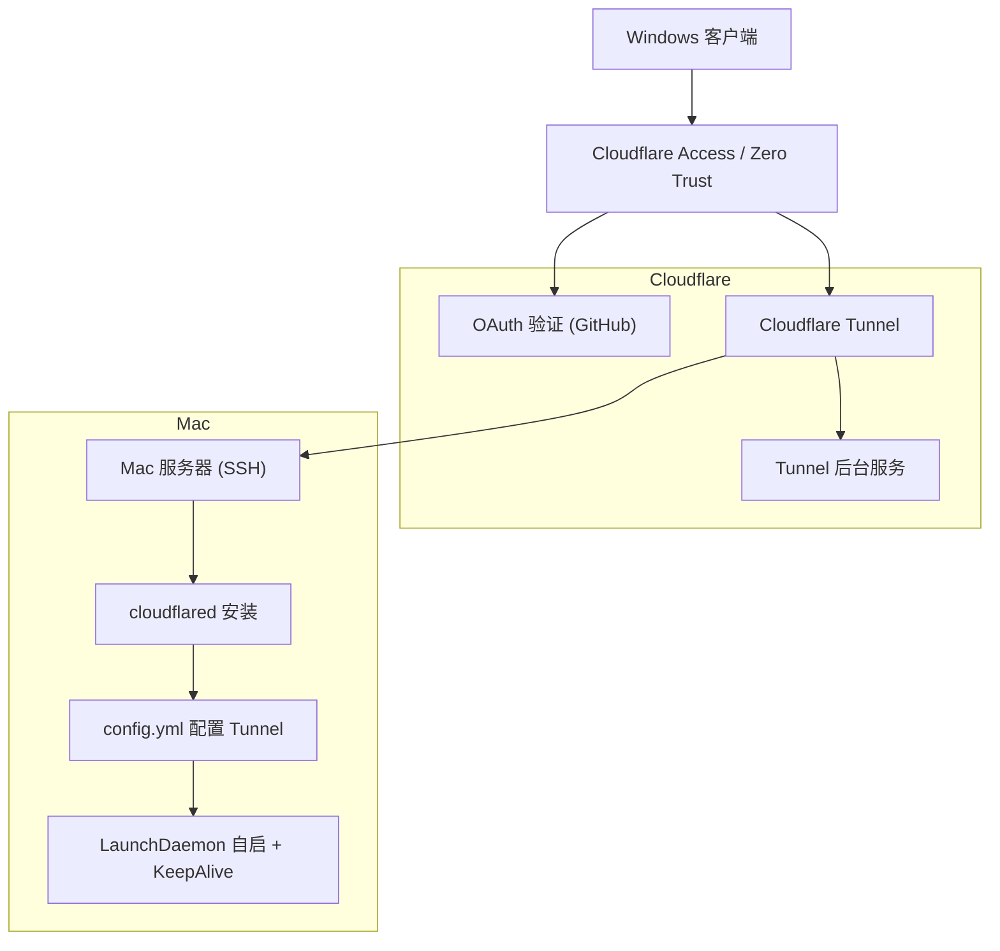

前几天用 Tailscale 组了个大内网，想连家里的 iMac 但是不知道为啥这个 Tailscale GUI 每次重启都要重新认证，好麻烦的，于是准备用 [Cloudflare Tunnel](https://www.cloudflare-cn.com/products/tunnel/) [note:**Cloudflare Tunnel** 是一款隧道软件，旨在为应用程序和基础设施提供快速、安全的加密流量传输，同时隐藏 Web 服务器的 IP 地址，防止直接攻击。它特别适用于没有公网 IP 的场景，帮助用户从公网安全访问内网服务。]结合 [Zero Trust](https://www.cloudflare-cn.com/learning/security/glossary/what-is-zero-trust/) 给家宽打个洞，只要能连上 ssh 就行！

先给服务端 （Mac） 和客户端 (Windows) 装上 `cloudflared`，然后在 mac 上写一个妙妙 `config.yml` 文件，大概是：

```yml
tunnel: homelab
credentials-file:path-to-cert

ingress:
  - hostname: xxx.xxx.xxx
    service: ssh://localhost:22
    
- service:http_status:404
```

写完之后 `cloudflared tunnel run homelab` 就 ok。

然后去搞 Cloudflare 的 ZeroTrust，大失败！没有信用卡，连免费套餐都要绑定信用卡！

查了一下发现可以把`https://one.dash.cloudflare.com`后面的路径全部删除，这样就能跳过去了。不过这样没法管理应用程序了[note:会循环跳转到添加付款方式那一步]，坏，自然也就没法把服务规则 (Access Rule) 绑定上去了，这不是废了！

试了一下发现其实可以先创建规则，这样就好了，哎，当时在 get started 的时候搞太快忽略过去了，坏。然后可以加个认证方式，比如用 GitHub，根据官方的指导创建一个 OAuth App 认证就可以了！

然后在 Windows 上测试一下连接：

```bash
cloudflared access ssh --hostname mac.012607.xyz
```

会弹出一个 OAuth 浏览器窗口，验证一下，好耶，连上了，下面编辑 `~\.ssh\config`:

```
Host mac
  HostName host
  User username
  ProxyCommand cloudflared access ssh --hostname %h
```

这样就可以通过 `ssh mac` 直接建立连接了，相当的方便，不用记那些长串的乱七八糟的命令了！

不过似乎还是那个问题，macOS 一重启 tunnel 就断开了，还是要手动开一下，根本就不方便！

一开始试了一下什么`sudo cloudflared service install``sudo launchctl kickstart -k system/com.cloudflare.cloudflared`，结果 `sudo reboot` 重启之后发现只启动了 Cloudflare Tunnel 的核心服务，绑定的 Tunnel 压根没启动，我去，那有什么用？[note: 奇怪，这里的症候和 Tailscale 的有点像，哎，这 macOS 的逻辑真是奇怪啊，有点搞不懂！]

哎，和 AI 对线了半天，告诉我可能需要自己创建一个自启 + 后台保活项了，比如 `/Library/LaunchDaemons/com.cloudflare.homelab.plist`：

```xml
<?xml version="1.0" encoding="UTF-8"?>
<!DOCTYPE plist PUBLIC "-//Apple//DTD PLIST 1.0//EN" "http://www.apple.com/DTDs/PropertyList-1.0.dtd">
<plist version="1.0">
    <dict>
        <key>Label</key>
        <string>com.cloudflare.homelab</string>
        <key>ProgramArguments</key>
        <array>
            <string>/usr/local/bin/cloudflared</string>
            <string>tunnel</string>
            <string>run</string>
            <string>homelab</string>
        </array>
        <key>RunAtLoad</key>
        <true />
        <key>KeepAlive</key>
        <true />
        <key>StandardOutPath</key>
        <string>/Library/Logs/cloudflared-homelab.out.log</string>
        <key>StandardErrorPath</key>
        <string>/Library/Logs/cloudflared-homelab.err.log</string>
    </dict>
</plist>
```

哎，结果发现还是不行，看了眼日志，竟然发现是 Tunnel 找不到证书导致的！

```bash
Cannot determine default origin certificate path
error parsing tunnel ID: client didn't specify origincert path
```

哦哦哦，原来是执行的时候找不到 `config.yml` 导致的啊，手动加上：

```xml
<array>
    <string>/usr/local/bin/cloudflared</string>
    <string>--config</string>
    <string>/Users/xxx/.cloudflared/config.yml</string>
    <string>tunnel</string>
    <string>run</string>
    <string>homelab</string>
</array>
```

然后重启服务:

```bash
sudo launchctl unload /Library/LaunchDaemons/com.cloudflare.homelab.plist
sudo launchctl load /Library/LaunchDaemons/com.cloudflare.homelab.plist
sudo launchctl start com.cloudflare.homelab
```

查找一下服务：

```bash
ps aux | grep cloudflared
```

哇哦，终于看到 `tunnel run homelab` 了，好耶，这下算是搞定了！

最终结果：

:::fullwidth



:::